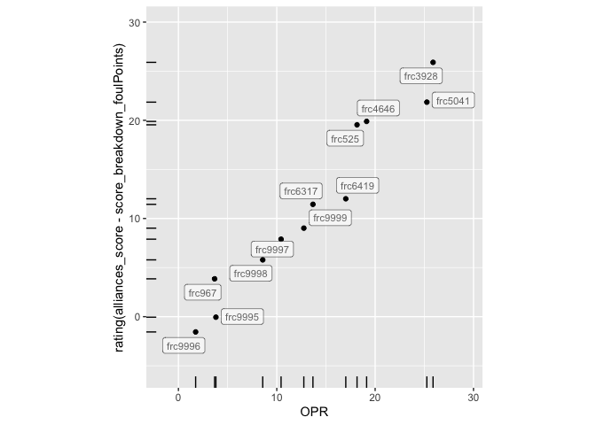
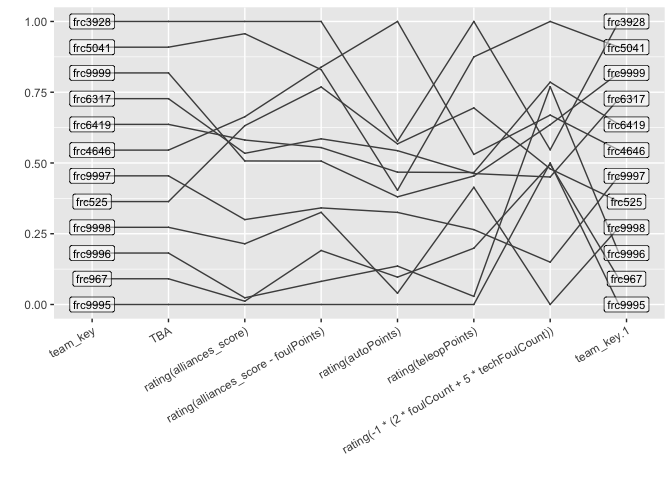

<!-- README.md is generated from README.Rmd. Please edit that file -->

# tba

<!-- badges: start -->

<!-- badges: end -->

The goal of the tba package is to provide easy access to match data for
events run in the first robotics division. Access is based on the Read
API v3 of [The Blue Alliance](https://www.thebluealliance.com/).

## Installation

You can install the development version of tba from
[GitHub](https://github.com/) with:

``` r
# install.packages("pak")
pak::pak("heike/tba")
```

In order to access the API of The Blue Alliance, you will need to [sign
up for a (free) account](https://www.thebluealliance.com/apidocs/v3).
Then run

``` r
tba::set_api_key(key = "jnn1ZiUfqPuA9UJyV9EVa3jtL5qudBBlYXKPEVQDeQgQgz5L8BypwjTzVKxtCs3W") 
# key is not valid, get your own!
```

## Example

This is a basic example which shows you how to solve a common problem:

``` r
library(tba)
## basic example code

# Team Neutrino has team code `frc3928` 
get_records("team/frc3928")
#> $address
#> NULL
#> 
#> $city
#> [1] "Ames"
#> 
#> $country
#> [1] "USA"
#> 
#> $gmaps_place_id
#> NULL
#> 
#> $gmaps_url
#> NULL
#> 
#> $key
#> [1] "frc3928"
#> 
#> $lat
#> NULL
#> 
#> $lng
#> NULL
#> 
#> $location_name
#> NULL
#> 
#> $motto
#> NULL
#> 
#> $name
#> [1] "Iowa 4-H Foundation & Story County 4-H/Iowa State University College of Engineering/3M/Bayer Fund/John Deere/Terracon Foundation/Intuitive Foundation/Gene Haas Foundation/Danfoss/Collins Aerospace (RTX)/Chevron/Renewable Energy Group/Molex/Workiva, Inc/National Instruments/Emerson/CIT Signature Transportation/Kingland Systems/City of Ames Electric Services/Story County United Way/Interstate Battery - Ames/Ludicrous Creations/The Loft&4-H"
#> 
#> $nickname
#> [1] "Team Neutrino"
#> 
#> $postal_code
#> [1] "50011"
#> 
#> $rookie_year
#> [1] 2012
#> 
#> $school_name
#> [1] "4-H"
#> 
#> $state_prov
#> [1] "Iowa"
#> 
#> $team_number
#> [1] 3928
#> 
#> $website
#> [1] "https://www.teamneutrino.org"

# In the 2024 season, the team attended the following events:
events <- get_records("team/frc3928/events/2024")
events$name
#> [1] "Cow Town Throwdown"        "Galileo Division"         
#> [3] "Iowa Regional"             "Clash in the Corn"        
#> [5] "Central Missouri Regional"
events$event_code
#> [1] "cttd"  "gal"   "iacf"  "iawes" "mose"
```

### Access Score Data from a Competition

The matches from *Clash in the Corn* can be accessed using the event
code `2024iawes`:

``` r
library(dplyr)
matches <- get_records("event/2024iawes/matches")
count(matches, comp_level)
#>   comp_level  n
#> 1          f  2
#> 2         qm 22
#> 3         sf  5
# 22 qualifying matches
# 5 semi-finals
# 2 finals
```

The function `get_match_details` turns the records into a more
manageable form by turning the match-based rows from the `get_records`
results into team-based results, i.e. every row corresponds to the
detailed scores of each team in each one of the matches:

``` r
scores <- get_match_details(matches)
head(scores %>% select(comp_level, match_number, set_number, alliance, team_key, alliances_score, ends_with("Points")))
#> # A tibble: 6 × 25
#>   comp_level match_number set_number alliance team_key alliances_score
#>   <chr>             <int>      <int> <chr>    <chr>              <int>
#> 1 f                     1          1 blue     frc9998               38
#> 2 f                     1          1 blue     frc6419               38
#> 3 f                     1          1 blue     frc4646               38
#> 4 f                     2          1 blue     frc9998               44
#> 5 f                     2          1 blue     frc6419               44
#> 6 f                     2          1 blue     frc4646               44
#> # ℹ 19 more variables: score_breakdown_adjustPoints <int>,
#> #   score_breakdown_autoAmpNotePoints <int>,
#> #   score_breakdown_autoLeavePoints <int>, score_breakdown_autoPoints <int>,
#> #   score_breakdown_autoSpeakerNotePoints <int>,
#> #   score_breakdown_autoTotalNotePoints <int>,
#> #   score_breakdown_endGameHarmonyPoints <int>,
#> #   score_breakdown_endGameNoteInTrapPoints <int>, …
```

### Calculate a team’s contribution to an outcome

The function `get_ranking_by` allows a ranking of each team (not the
alliance!) by any numeric variable. It only makes sense to use matches
from the qualifying round. The resulting number is an estimate of the
team’s contribution to the chosen measurement. When using
`get_ranking_by` with the `score` from the qualifying matches, the
resulting coefficients for the ranking is the Offesnive Power Rating
(OPR) - as published on the TBA API under insights.

``` r
# ranking by OPR
scores %>% filter(comp_level=="qm") %>%
  get_ranking_by(alliances_score)
#> # A tibble: 12 × 3
#>    team_key     n `rating(alliances_score)`
#>    <chr>    <int>                     <dbl>
#>  1 frc3928     11                     24.8 
#>  2 frc5041     11                     23.8 
#>  3 frc4646     11                     17.2 
#>  4 frc525      11                     16.5 
#>  5 frc6419     11                     15.4 
#>  6 frc6317     11                     14.3 
#>  7 frc9999     11                     13.7 
#>  8 frc9997     11                      9.06
#>  9 frc9998     11                      7.14
#> 10 frc9996     11                      2.86
#> 11 frc967      11                      2.58
#> 12 frc9995     11                      2.32
```

It makes sense, to not include points from fouls (assuming that it is
hard to make another team foul one’s alliance):

``` r
no_fouls <- scores %>% filter(comp_level == "qm") %>%
  get_ranking_by(alliances_score - score_breakdown_foulPoints)
head(no_fouls)
#> # A tibble: 6 × 3
#>   team_key     n `rating(alliances_score - score_breakdown_foulPoints)`
#>   <chr>    <int>                                                  <dbl>
#> 1 frc3928     11                                                   23.6
#> 2 frc4646     11                                                   19.4
#> 3 frc5041     11                                                   19.1
#> 4 frc525      11                                                   17.5
#> 5 frc6317     11                                                   12.7
#> 6 frc6419     11                                                   11.9
```

Most of the time, the resulting ranking should be quite similar, but
differences in these rankings might give some insight as to whether some
teams profitted from being fouled during the qualification round. In
this example, most of the rankings stay the same, but the 2nd and the
3rd team switch places: `frc5041` seems to have benefitted during the
qualifying matches more from their opponents’ fouls than `frc4646`.
Their rating of contribution to the team’s score without counting fouls
is quite similar.

``` r
scores %>% filter(comp_level=="qm") %>%
  get_ranking_by(alliances_score-score_breakdown_foulPoints)
#> # A tibble: 12 × 3
#>    team_key     n `rating(alliances_score - score_breakdown_foulPoints)`
#>    <chr>    <int>                                                  <dbl>
#>  1 frc3928     11                                                 23.6  
#>  2 frc4646     11                                                 19.4  
#>  3 frc5041     11                                                 19.1  
#>  4 frc525      11                                                 17.5  
#>  5 frc6317     11                                                 12.7  
#>  6 frc6419     11                                                 11.9  
#>  7 frc9999     11                                                 10.7  
#>  8 frc9997     11                                                  6.37 
#>  9 frc9998     11                                                  5.96 
#> 10 frc967      11                                                  2.44 
#> 11 frc9996     11                                                 -0.409
#> 12 frc9995     11                                                 -2.54
```

### Comparing Multiple Outcomes

By comparing the two measures visually we also see, that the big gap
between the top two teams and the other teams suggested by the OPR
ranking, turns into a group of four teams with a gap to the remaining
teams:

``` r
library(tidyverse)
library(ggplot2)

# combine the OPR with the ranking not including fouls:
all_points <- scores %>% get_ranking_by(alliances_score, alliances_score-score_breakdown_foulPoints)
all_points %>% ggplot(aes(x = `rating(alliances_score)`, y = `rating(alliances_score - score_breakdown_foulPoints)`)) + 
  geom_point() + xlab("OPR") + 
  ggrepel::geom_label_repel(aes(label = team_key), size=3, alpha = 0.6) +
  geom_rug(length = unit(0.03, "npc")) +
  scale_y_continuous(expand = c(0.2, 0.2)) +
  scale_x_continuous(expand = c(0.2, 0.2)) +
  coord_equal()
```

<div class="figure">


<p class="caption">

Scatterplot of team contributions measured in OPR (x axis) and to the
score without foul points (y axis).
</p>

</div>

### Worst fouling team

Any of the details going into the score can be used as outcome
measurement. The number of points given to the opponent because of a
team’s foul is determined (in the 2024 season) as 5 points for a foul
and 2 points for a technical foul. The list below is sorted from worst
offenders to least offenders. A negative number might be interpreted as
a team’s ability to provoke fouls from the opponents.

``` r
scores %>% filter(comp_level=="qm") %>%
  get_ranking_by(2*score_breakdown_foulCount+5*score_breakdown_techFoulCount) 
#> # A tibble: 12 × 3
#>    team_key     n `rating(2 * score_breakdown_foulCount + ...)`
#>    <chr>    <int>                                         <dbl>
#>  1 frc9998     11                                        6.06  
#>  2 frc9997     11                                        4.91  
#>  3 frc6317     11                                        2.60  
#>  4 frc525      11                                        2.38  
#>  5 frc967      11                                        2.25  
#>  6 frc9995     11                                        2.22  
#>  7 frc3928     11                                        1.86  
#>  8 frc9999     11                                        1.18  
#>  9 frc4646     11                                        0.917 
#> 10 frc9996     11                                        0.146 
#> 11 frc6419     11                                        0.0238
#> 12 frc5041     11                                       -1.62
```

### Best at categories

``` r
names(scores) <- gsub("score_breakdown_", "", names(scores))
detailed <- scores %>% filter(comp_level=="qm") %>%
  get_ranking_by(alliances_score, alliances_score - foulPoints, autoPoints, teleopPoints, -1*(2*foulCount+5*techFoulCount)) 

# add the tba rating to the mix:
tba_rating <- tba_ranking("2024iawes")
detailed <- detailed %>% left_join(tba_rating %>% select(team_key, TBA=rank), by="team_key")
```

Taking more measures into account, we can see in the parallel coordinate
plot below, that the third place TBA ranking for team frc9999 is not
backed up by a similar high performance in the contribution to the
score, which is indicative of a lot of luck and/or strategy in the
qualifying matches. On the other hand, team frc4646 is in the top three
performing teams except for their TBA ranking, indicating that they
would be a great pick for any alliance. Similarly, team frc525 would
make a good contributing partner in an alliance.

``` r
library(ggpcp)


 detailed %>% 
   mutate(
     TBA = max(TBA)-TBA,
    team_key = reorder(factor(team_key), TBA) 
    ) %>%
   pcp_select(team_key, TBA, starts_with("rating"), team_key) %>%
   pcp_scale() %>%
   ggplot(aes_pcp()) + 
   geom_pcp() + 
   geom_pcp_labels(size=3) + 
   xlab("") + ylab("") + 
   theme(axis.text.x = element_text(angle=30, hjust=1))
```

<div class="figure">


<p class="caption">

Parallel Coordinate Plot of multiple measures showing different aspects
of a team’s contribution. Higher is better for all measures.
</p>

</div>
